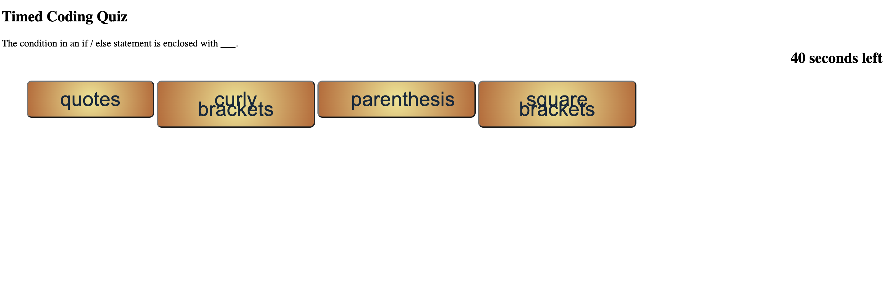

# Timed Coding Quiz
> This is a timed coding quiz with mutliple choice questions.  It features HTML and CSS powered by JavaScript.
> Live demo [_here_](https://kristinehkim.github.io/timed-coding-quiz/). <!-- If you have the project hosted somewhere, include the link here. -->

## Table of Contents
* [General Info](#general-information)
* [Features](#features)
* [Screenshots](#screenshots)
* [Usage](#usage)
* [Project Status](#project-status)
* [Room for Improvement](#room-for-improvement)
* [Acknowledgements](#acknowledgements)
* [Contact](#contact)
<!-- * [License](#license) -->

## General Information
This is a timed coding quiz with multiple choice questions.  The user has 75 seconds to complete the quiz.  When the user chooses the answer correctly, it will move on to the next question.  If the user answers it incorrectly, 15 seconds will be taken off the time.  The time left at the end of the game is the user's score, or the game ends when the time runs out.
<!-- You don't have to answer all the questions - just the ones relevant to your project. -->

## Features
- Countdown timer
- Time decrements by 15 seconds when incorrect answer is chosen.

## Screenshots

<!-- If you have screenshots you'd like to share, include them here. -->

## Usage
The user will click the start button to begin the coding quiz.  The user will be presented with a statement and will have to click on the correct response.  If the user clicks on the incorrect response, the timer will subtract 15 seconds.  If the user clicks the correct response, it will move on to the next statement.  The game ends when the time runs out or when the user answers all questions.  The remaining time is the final score.

## Project Status
Project is: _in progress_

## Room for Improvement
Include areas you believe need improvement / could be improved. Also add TODOs for future development.

Room for improvement:
-Needs to be able to save multiple players' initials and scores.  I started but wasn't able to figure it out.
- Needs to be programmed to reset.  Right now, the page has to be refreshed to play the game again.

## Acknowledgements
- Many thanks to my instuctor, Michael Pacheco, the TAs, Nirav Venkatesan and Julius Dorfman, and tutor, Dane Shrewsbury. Also, to all the Ask BCS people that helped me!

## Contact
Created by Kristine Kim.  Feel free to email me at kristinehkim@gmail.com. 

<!-- Optional -->
<!-- ## License -->
<!-- This project is open source and available under the [... License](). -->

<!-- You don't have to include all sections - just the one's relevant to your project -->